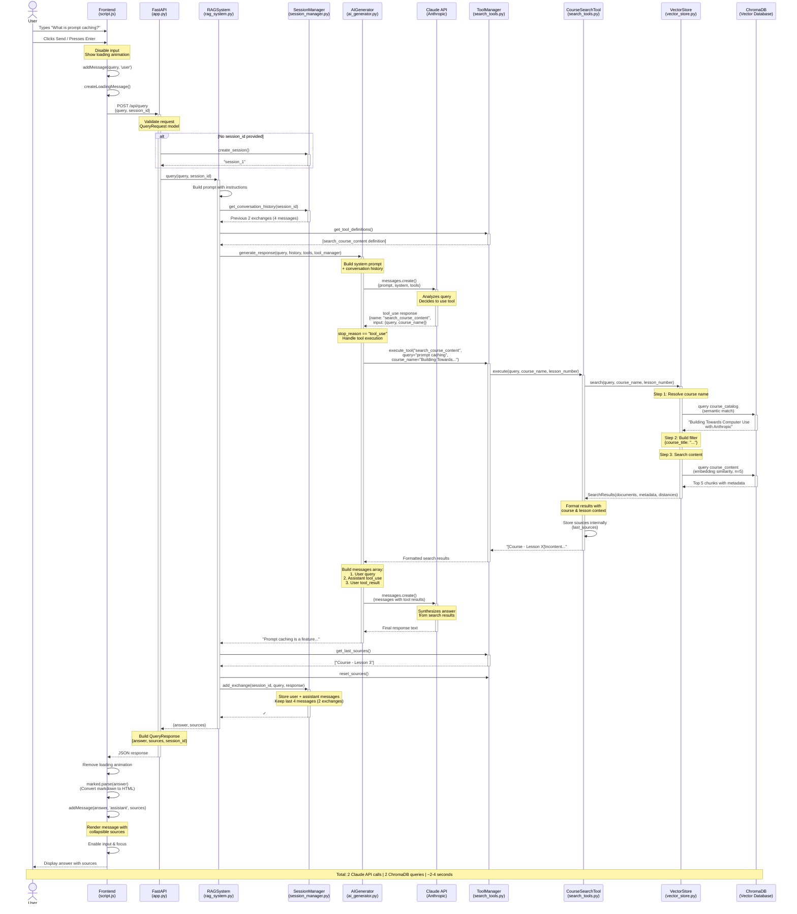

# RAG Chatbot Query Flow Diagram

## Key Components Interaction Summary

### Three-Phase Architecture

**Phase 1: User Interface Layer**
- Frontend captures input and manages UI state
- Handles loading states and user feedback
- Renders markdown responses with source attribution

**Phase 2: Application Logic Layer**
- FastAPI validates requests and manages sessions
- RAGSystem orchestrates the complete workflow
- SessionManager maintains conversation context

**Phase 3: AI & Data Layer**
- AIGenerator manages Claude API interactions with tool support
- ToolManager coordinates available search capabilities
- VectorStore performs semantic search on ChromaDB
- ChromaDB stores and retrieves vectorized course content

### Critical Interactions

1. **Tool-Based Agent Pattern**: Claude decides whether to search based on query analysis
2. **Two-Step Vector Search**: First resolves course name, then searches content
3. **Session Continuity**: Conversation history flows through entire pipeline
4. **Source Attribution**: Sources tracked from ChromaDB → Search Tool → Frontend

### Performance Characteristics

- **Latency Bottlenecks**:
  - Claude API calls (~1-2s each)
  - Vector embedding & search (~100-500ms)

- **Optimization Strategies**:
  - Temperature=0 for deterministic responses
  - Max 5 search results to limit context
  - Session history capped at 2 exchanges
  - Sentence-based chunking with overlap for better semantic retrieval
